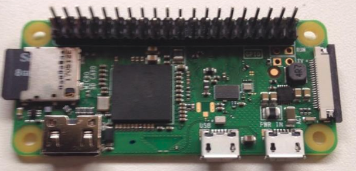
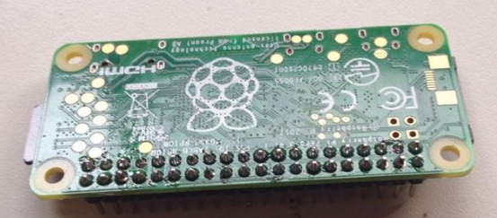
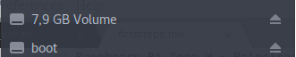

## Raspberry Pi Zero W - Configuração via linha de comando.

### Soldagem da barra de pinos

A primeira coisa a se fazer é soldar a barra de pinos. O RPi Zero W possui 40 pinos de GPIO, a barra que eu utilizei foi [essa](https://www.filipeflop.com/produto/barra-de-pinos-2x40-180-graus/), ela possui 80 pinos, então é preciso cortar a barra pela metade, utilize um alicate de corte para isso. Esse [vídeo](https://www.youtube.com/watch?v=8N18lIL3Uwk) possui boas dicas de como soldar a barra no RPi. O processo requer paciência e um local bem iluminado. 
**Dica**: Não force muito a barra na protoboard que ela quebra. Veja o vídeo com atenção.
 

### Passando o Raspian para o Sd Card

Para passar o Raspian para um sd card, você precisa inserir o cartão em seu computador, caso seu pc não tenha entrada para sd card utilize um [adaptador](https://www.americanas.com.br/produto/21282117/mini-leitor-adaptador-pen-drive-usb-para-cartao-micro-sd?WT.srch=1&epar=bp_pl_00_go_pla_infeaces_rlsa_novos_3p&gclid=CjwKCAjwmK3OBRBKEiwAOL6t1AMIb47JaUxRzuODGdxwxoSFEU4D88GIs8lLNFQKD8jsyCOFBeJdsxoCzM0QAvD_BwE&opn=YSMESP&sellerId=8215490000317). Baixe a versão lite do Raspian caso você não for utilizar a interface gráfica do mesmo. Eu utilizei o Etcher para gravar a imagem no cartão.

* [Raspian](https://www.raspberrypi.org/downloads/raspbian/)
* [Etcher](https://etcher.io/)

A imagem do Raspian vai estar zipada, extraia a imagem e  grave ela com o Etcher.

### Habilitando SSH e Wifi

**Atenção, essas configurações são feitas com o cartão de memória ainda conectado ao seu computador**. Após o Etcher gravar a imagem no cartão, provavelmente o seu sistema operacional irá reconhecer e montar o cartão como mostra a imagem a baixo.



Caso a partição *boot* não aparecer, retire e insira novamente o cartão no computador. Agora vem a parte da configuração que sera feita toda usando o terminal, então abra um e mãos a obra. 

Primeiro vá até a partição boot:
```shell
cd /media/*usuarioLogado*/boot
```

**Onde *usuarioLogado* é o nome do usuário que você esta logado no computador.**
Caso o cartão não esteja montado na pasta */media* utilize o comando *df -h* para localizar onde foi montado.

Para habilitar o acesso ssh crie um arquivo com o nome *ssh*:
```shell
sudo touch ssh
```

Para habilitar o Wifi crie um arquivo com o nome *wpa_supplicant.conf* e insira o seguinte conteúdo nele:
```shell
sudo touch wpa_supplicant.conf
```

```
country=US
ctrl_interface=DIR=/var/run/wpa_supplicant GROUP=netdev
update_config=1

network={
 ssid="WIFI_SSID"
 scan_ssid=1
 psk="WIFI_PASSWORD"
 key_mgmt=WPA-PSK
}
```

**Onde *WIFI_SSID* e *WIFI_PASSWORD* são, respectivamente, o nome e a senha da rede wifi e que você deseja se conectar.**

Pronto, desmonte o cartão de memória e retire do seu computador.

### Acessando o RPi zero W via ssh

Agora insira o cartão de memória no RPi e conecte o cabo mini usb em uma das portas mini usb do RPi. Conecte a outra ponta do cabo mini usb ao seu computador e espere o led do RPi parar de piscar, essa primeira inicialização do RPi demora em torno de 90sec. Para acessar o RPi via ssh é preciso saber o IP que a placa recebeu em sua rede Wifi, isso pode ser meio chato caso você não tenha acesso a pagina de configuração do roteador de sua rede. Se você possui o acesso, abra o navegador, digite o IP do roteador na barra de endereços, vá em *status* e verifique qual o IP do RPi. Caso contrário utilize o programa [Angry IP Scanner](http://angryip.org/download/#linux) ou qualquer outra ferramenta que liste os IP's de sua rede.

Com o IP em mãos, acesse o RPi via ssh:
```shell
ssh pi@*192.1.2.3*
```

**Substitua *192.1.2.3* pelo o IP do RPi** 
**Login e Senha padrão**
**Login:** pi
**Senha:** raspberry

Mude a senha padrão:
```shell
passwd
```

Atualize o Raspian:
```shell
sudo apt-get update && sudo apt-get upgrade -y 
```

Instale o pip:
```shell
sudo apt-get install python-pip
```

E é isso! Seu Raspberry Pi Zero W esta configurado e pronto para uso.

**Fonte:** https://www.losant.com/blog/getting-started-with-the-raspberry-pi-zero-w-without-a-monitor

**Autor:** Kauly R. Bohm